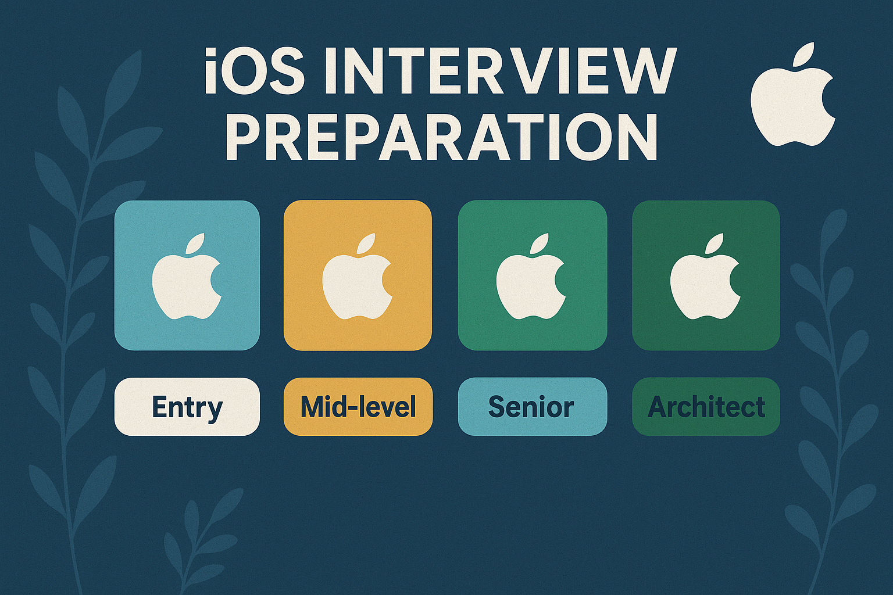

# iOS Interview Preparation Guide

  

> **🎯 The most comprehensive iOS interview preparation resource with 110+ real interview questions, detailed answers, and production-ready Swift code examples.**

A complete guide for iOS developers preparing for interviews at **Apple, Google, Meta, Amazon, and top tech companies**. Master Swift programming, UIKit, SwiftUI, architecture patterns, concurrency, and advanced iOS development topics.

**📖 [Read Online](https://github.com/mukundjogi/ios-interview/)** | **⭐ [Star This Repo](https://github.com/mukundjogi/ios-interview)** | **🐛 [Report Issue](https://github.com/mukundjogi/ios-interview/issues)**

## 📚 Table of Contents

### Getting Started
- [Introduction](docs/introduction.md) - Why prepare, how to prepare effectively, interview levels and patterns
- [📋 Interview Questions Index](docs/QUESTIONS_INDEX.md) - Quick reference to all 110+ interview questions

### Core iOS Development

- [iOS Basics](docs/ios-basics.md) - iOS ecosystem, app lifecycle, UIViewController lifecycle, and core components
- [Swift Programming](docs/swift-programming.md) - Swift language fundamentals, optionals, closures, error handling, and ARC
- [OOP and Protocol-Oriented Programming](docs/oop-and-pop.md) - Object-oriented and protocol-oriented programming concepts in Swift

### User Interface Development

- [UIKit Development](docs/uikit-development.md) - Storyboards, Auto Layout, TableView, CollectionView, and accessibility
- [SwiftUI](docs/swiftui.md) - Declarative UI, state management, navigation, and animations

### Data and Networking

- [Data Persistence](docs/data-persistence.md) - UserDefaults, Keychain, Core Data, SQLite, and Realm
- [Networking](docs/networking.md) - URLSession, REST APIs, Codable, Combine, and third-party libraries

### Advanced Development

- [Multithreading and Concurrency](docs/multithreading-concurrency.md) - GCD, OperationQueue, async/await, and concurrency best practices
- [Architecture and Design Patterns](docs/architecture-design-patterns.md) - MVC, MVVM, VIPER, SOLID principles, and clean architecture
- [Dependency Management](docs/dependency-management.md) - Swift Package Manager, CocoaPods, Carthage, and XCFrameworks

### Performance and Quality

- [Memory Management and Performance](docs/memory-management.md) - ARC deep dive, retain cycles, memory leaks, and optimization
- [Testing](docs/testing.md) - Unit testing, UI testing, TDD, BDD, and test doubles

### Specialized Topics

- [Advanced Topics](docs/advanced-topics.md) - Combine framework, app extensions, push notifications, and deep linking
- [Security](docs/security.md) - Secure coding practices, SSL pinning, and certificate validation
- [App Distribution & In-App Purchase](docs/app-distribution-iap.md) - Certificates, provisioning profiles, App Store deployment, and IAP implementation

## 🎯 How to Use This Guide

1. **For Beginners**: Start with Introduction → iOS Basics → Swift Programming → UIKit Development
2. **For Mid-level Developers**: Focus on Architecture, Design Patterns, Networking, and Data Persistence
3. **For Senior/Lead Roles**: Deep dive into Advanced Topics, Security, Performance Optimization, and Testing
4. **Interview Prep**: Read the relevant topic, understand the theory, practice the examples, and prepare answers

## 💡 What Makes This Guide Special

- **Theory with Examples**: Every concept explained with practical Swift code examples
- **110+ Interview Q&A**: Each topic includes 5-7 comprehensive interview questions with detailed answers
- **Interview-Focused**: Real questions asked by Apple, Google, Meta, and other top companies
- **Real-World Scenarios**: Practical use cases from production apps

## 🚀 Quick Navigation by Role

### Fresher / Entry-Level
Focus on: iOS Basics, Swift Programming, UIKit Development, Basic Data Persistence

### Mid-Level (2-4 years)
Focus on: Architecture Patterns, Networking, SwiftUI, Multithreading, Testing

### Senior (5+ years)
Focus on: Design Patterns, Memory Management, Performance, Security, Advanced Topics, App Distribution

### Architect / Lead
Focus on: Clean Architecture, SOLID Principles, Dependency Management, System Design

## 🌟 Why Choose This Guide?

✅ **110+ Real Interview Questions** - Actual questions from FAANG and top companies  
✅ **Production-Ready Code** - Examples from real-world iOS applications  
✅ **Constantly Updated** - Latest iOS 17 features and Swift 5.9+ syntax  
✅ **Interview-Focused Answers** - Formatted specifically for interview responses  
✅ **All Experience Levels** - From entry-level to senior architect positions  
✅ **Free & Open Source** - Community-driven, always free  

## 📊 Coverage Statistics

- **15 Comprehensive Topics**
- **110+ Interview Questions & Answers**
- **500+ Code Examples**
- **iOS 13 to iOS 17+ Coverage**
- **Swift 5.9+ Compatible**
- **Covers UIKit & SwiftUI**

## 🚀 Getting Started

### Quick Navigation
- **New to iOS?** Start with [Introduction](docs/introduction.md) → [iOS Basics](docs/ios-basics.md)
- **Interview Tomorrow?** Go to [📋 Top 20 Questions](docs/QUESTIONS_INDEX.md#-most-frequently-asked-questions)
- **Specific Topic?** Use [Table of Contents](#-table-of-contents)
- **Want All Questions?** Check [Complete Questions Index](docs/QUESTIONS_INDEX.md)

## 📖 Contributing

We welcome contributions from the community! See [CONTRIBUTING.md](CONTRIBUTING.md) for guidelines.

### How to Contribute
- ⭐ Star this repository
- 🐛 Report bugs or issues
- 💡 Suggest new questions or topics
- 📝 Improve documentation
- 🔧 Fix typos or errors
- 🎉 Share with fellow iOS developers

## 📄 License

This project is licensed under the MIT License - see the [LICENSE](LICENSE) file for details.

## 👨‍💻 About the Author

**Mukund Jogi** - Engineering Lead & Mobile App Specialist

- 🌐 **Portfolio**: [mukundjogi-portfolio.vercel.app](https://mukundjogi-portfolio.vercel.app/)
- 💼 **LinkedIn**: [linkedin.com/in/mukund-jogi](https://www.linkedin.com/in/mukund-jogi/)
- 🐙 **GitHub**: [github.com/mukundjogi](https://github.com/mukundjogi)
- 💬 **1:1 Mentorship**: [topmate.io/mukundjogi](https://topmate.io/mukundjogi)

## 🔗 Repository Links

- 🌐 **Website**: [https://github.com/mukundjogi/ios-interview](https://github.com/mukundjogi/ios-interview)
- 📦 **GitHub**: [https://github.com/mukundjogi/ios-interview](https://github.com/mukundjogi/ios-interview)
- 💬 **Discussions**: [GitHub Discussions](https://github.com/mukundjogi/ios-interview/discussions)
- 🐛 **Issues**: [Report Issues](https://github.com/mukundjogi/ios-interview/issues)

### Share This Repository

If this guide helped you, please:
- ⭐ **Star** this repository
- 🔀 **Fork** for your own reference
- 📢 **Share** on LinkedIn, Twitter, Reddit
- 💬 **Recommend** to fellow iOS developers

## 🏷️ Topics

`ios` `swift` `interview-questions` `ios-development` `swift-programming` `uikit` `swiftui` `ios-interview` `mobile-development` `interview-preparation` `coding-interview` `tech-interview` `apple-interview` `ios-developer` `swift-interview` `architecture-patterns` `design-patterns` `concurrency` `memory-management` `testing`

## 📈 Repository Activity

---

**Created with ❤️ for iOS developers preparing for interviews at product companies, service companies, and startups worldwide.**

**Happy Learning! 🍎**

---

### Don't forget to ⭐ star this repository if you found it helpful!

**[📖 Read Online](https://mukundjogi.github.io/ios-interview)** • **[📋 All Questions](docs/QUESTIONS_INDEX.md)** • **[🤝 Contribute](CONTRIBUTING.md)**

